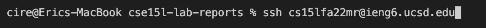

## Lab Report 1
______
# 1. Installing VScode
[VScode](https://code.visualstudio.com/)   
Follow the link above to install VScode. 

 After clicking the link, it should bring you to a page similar to this which you will then click on "Download Mac Universal" or the dropdown next to it for other options.

 
 After the file has download, click on the zip file for it to fully install.

 Once VScode has finish installing, you should open the application and it should look like this.

 

# 2. Remotely Connecting
 Remote connecting is a way to access remote server through the internet to access other OS, files, or programs that are not accessible from your personal computer.
 I have a MacBook but if you have a Windows computer you will need to install [OpenSSH client](https://learn.microsoft.com/en-us/windows-server/administration/openssh/openssh_install_firstuse?tabs=gui)

 To begin you need to open the terminal in VScode(Ctrl or Command + \`, or use the Terminal → New Terminal menu option)
In the terminal you will type in - `ssh (username)@ieng6.ucsd.edu`

 

 After entering the `ssh` in the terminal you will be prompted to enter a *password* (which will not show a response)

 

# 3. Trying Some Commands
 There are many useful commands we can run in the terminal. Some very useful ones are:
- ssh (server): securely connects to a remote server
- scp (file) (path): securely copies a file to a remote computer
- cd (path): changes the directory
- ls: lists files from the current directory
- cat (file): prints the contents of a file
- cp (file) (path): copies a file(not secure)

 

# 4. Moving Files with scp
 Other than accessing remote servers with `ssh`, you can also copy files from your device to the remote device. This can be accomplished through `scp` or "secure copy protocol"
 In the terminal you will type in - `scp (filename) (username)@ieng6.ucsd.edu`
 After entering the *scp* in the terminal you will be prompted to enter a *password* just like `ssh` and after the information has been submitted you will need to enter the remote server again through `ssh` to access the file you just copied

 

 As seen from the example above I ran `javac` and `java` for "WhereAmI.java" showing my directory information. Then after the "WhereAmI.java" has been copied to the remote server, I logged in again through `ssh` and ran `javac` and `java` for "WhereAmI.java" showing different results suggesting the terminal runs commands based on where the command is ran resulting in different outputs from remote and local computers. 

# 5. Setting an SSH Key
 As you seen before, it consumes time to use *ssh* and *scp* because the need to type in a password. However, that can be avoid by setting up an SSH Key for your computer so you won't need to type in a password everytime you access the remote server.
 To start you will enter `ssh-keygen` into the terminal, which you will be prompted by some text but you just need to press *enter* all the way through

 

 The result will look something like this and you will know it is completely after the image chart is produced.
 If you are on windows please you can follow [these](https://docs.microsoft.com/en-us/windows-server/administration/openssh/openssh_keymanagement#user-key-generation) steps.

 The next step is to log into the remote server with `ssh`
 After you are on the server, enter `mkdir .ssh` in the terminal then log out by typing `exit` in the terminal

 

 You will then need to `scp` the "public key" given to you after you entered `ssh-keygen` (remember the public key, not the private)

 `scp (public key) (username)@ieng6.ucsd.edu:~/.ssh/authorized_keys`

 After that is completed, the next time you *ssh* or `scp` into this remote server, there wouldn't be a prompted password

 

# 6. Optimizing Remote Running
 Something to consider while coding is optimization, and this can be succeeded through the reduction of keystrokes. For example:
- Using `;` will run multiple commands on the same line in the terminal instead of having you type commands out seperate times like `javac` and `java` or `ssh` and `scp`
- Using `""` will allow you to run commands inside the `""` right after `ssh` such as running `javac` and `java`

 `scp WhereAmI.java (username)@ieng6.ucsd.edu:~/; ssh (username)@ieng6.ucsd.edu "javac WhereAmI.java; java WhereAmI"`

 
 This example shows the use of `;` and `""` where right after the use of `scp`, `ssh` is also ran with `javac` and `java` inside the quotes.

