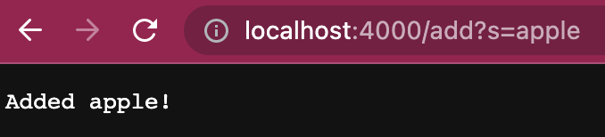
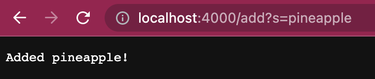
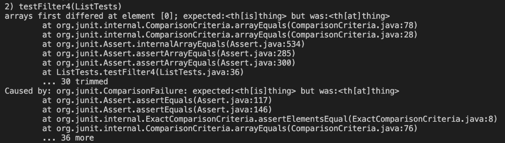

## Lab Report 2
______
# Part 1- Week 2 Lab

<br>*Simple Search Engine* Lab 2

```
import java.io.IOException;
import java.net.URI;
import java.util.ArrayList;
class Handler implements URLHandler{

    ArrayList<String> str = new ArrayList<String>();

    public String handleRequest(URI url) {
        if(url.getPath().equals("/")){
            return String.format("Search Something");
        }else if(url.getPath().equals("/search")) {
            String[] parameters = url.getQuery().split("=");
            String temp = "";
            for(int i = 0; i < str.size(); i++){
                if(str.get(i).contains(parameters[1])){
                    temp = temp + str.get(i) + " ,";
                }
            }
            temp = temp.substring(0, temp.length()-2);
            return String.format("Searched: %s", temp);
        }else {
        System.out.println("Path: " + url.getPath());
        if (url.getPath().contains("/add")) {
            String[] parameters = url.getQuery().split("=");
            if (parameters[0].equals("s")) {
                str.add(parameters[1]);
                return String.format("Added %s!", parameters[1]);
            }
        }
        return "404 Not Found!";
        }   
    }

}

class SearchEngine {
    public static void main(String[] args) throws IOException {
        if(args.length == 0){
            System.out.println("Missing port number! Try any number between 1024 to 49151");
            return;
        }

        int port = Integer.parseInt(args[0]);

        Server.start(port, new Handler());
    }
}
```
<br>This is a simple Search Engine implemented through a local web browser that supports paths for *adding* new strings to list and *querying* the list to return certain values.

<br>

<br>This instance calls the `handleRequest(URI url)` method with the relavant argument of *add* and *s* which then adds "apple" to an ArrayList. 

<br>

<br>This instance calls the `handleRequest(URI url)` method with the relavant argument of *add* and *s* which then adds "pineapple" to an ArrayList. 

<br>

<br>This instance calls the `handleRequest(URI url)` method with the relavant argument of *add* and *s* which then adds "pie" to an ArrayList. 

<br>Before everything the main method is called which looks for a valid *port* and starts the local server. 

<br>As seen these three instances uses the add method which calls `handleRequest(URI url)` method which it looks for the keyword *add* and *s* then adds them to an ArrayList. The *s* value allows the program to know when to parse the String so it determines where the String that need to be added is. 

<br>

<br>This instance here uses the search engine which calls the `handleRequest(URI url)` method as well but looks for a different keyword *search* and *s* which then it will query through the ArrayList created from *add* and return the values that is true to the query, in this case are Strings that contains "apple" within them. If the *s* argument were to be change for say "pie" then it will only print one value of "pie". 

# Part 2- Week 3 Lab

<br>*Symptoms and Failure-inducing Inputs* Lab 3

>From ListExamples.java
```
static List<String> filter(List<String> list, StringChecker sc) {
    List<String> result = new ArrayList<>();
    for(String s: list) {
      if(sc.checkString(s)) {
        result.add(0, s);
      }
    }
    return result;
  }
  ```
<br>Original Method Code

```
@Test
   public void testFilter4(){
       List<String> input = new ArrayList<String>(Arrays.asList("thisthing", "thatthing"));
       List<String> result = new ArrayList<String>(Arrays.asList("thisthing", "thatthing"));
 
       assertArrayEquals(result.toArray(), ListExamples.filter(input, new LongChecker()).toArray());
   }

```
<br>**Failure-inducing input**

<br>
<br>**Sympton**

The incorrect output presented in the terminal where the expected value was "<th[is]thing>" but resulted in "<th[at]thing>", showing that the order of the list is incorrect. 

<br>**The Bug**

 The bug in the code is its use of add where it adds the string that passes the StringChecker to the 0 index causing the result to be backwards even though it has all the correct strings filtered through. 
 
 For example and Array ["one", "two", "three"] would result in ["two", "one"] with the StringChecker who checks if the String contains the vowel "o" instead of of resturning ["one", "two"].

 The correct code should be 
```
static List<String> filter(List<String> list, StringChecker sc) {
    List<String> result = new ArrayList<>();
    for(String s: list) {
      if(sc.checkString(s)) {
        result.add(s); //this should just be .add(s) instead of .add(0,s)
      }
    }
    return result;
  }
  ```

  <br>The bug causes that symptom where it expected a different value that is also in the list because of how it added the value into the array from the front instead to the back to keep its order. This caused the order of the array to be reversed therefore the error in the Test. 


  >From LinkedList.java
  ```
  public void append(int value) {
        if(this.root == null) {
            this.root = new Node(value, null);
            return;
        }
        // If it's just one element, add if after that one
        Node n = this.root;
        if(n.next == null) {
            n.next = new Node(value, null);
            return;
        }
        // Otherwise, loop until the end and add at the end with a null
        while(n.next != null) {
            n = n.next;
            n.next = new Node(value, null);
        }
    }
  ```
<br>Original Method Code

```
@Test
   @Test
   public void testAppend(){
       LinkedList input = new LinkedList();
       input.append(1);
       input.append(2);
       input.append(3);
 
       LinkedList result = new LinkedList();
       result.root = new Node(1, new Node(2, new Node(3, null)));
 
       assertEquals(result.toString(), input.toString());
   }

```
<br>**Failure-inducing input**
<br>
<br>**Sympton**

The symptoms resulted in the test failed for the append() method because the append() method adds a new Node constantly when there is more than one Node in the LinkedList already. This doesn't stop causing the heap to run out of memory. 

<br>**The Bug**

 The bug in the code is the while condition it has where it will run continuously while “n.next != null” and “n.next = new Node(value, null);”, which adds the Node in the while loop when it is supposed to be after the loop after the method has iterated through tall the Nodes in the list. This causes the next node to constantly have n."next=null" which makes the method run continuously. 


 The correct code should be 
```
public void append(int value) {
        if(this.root == null) {
            this.root = new Node(value, null);
            return;
        }
        // If it's just one element, add if after that one
        Node n = this.root;
        if(n.next == null) {
            n.next = new Node(value, null);
            return;
        }
        // Otherwise, loop until the end and add at the end with a null
        while(n.next != null) {
            n = n.next;
        }
        n.next = new Node(value, null);//This line of code was originally in the while loop and needed to be moved out so when the while loop ends, this can be added to the end of the LinkedList insted of constantly adding causing a never ending loop.
    }
  ```

  <br> The symptom implied that there is a method that doesn't stop which connects to the bug in the code where inside the while it constantly adds a Node whose next value is null which will continously satisfy the while loop of while(n.next !=null).