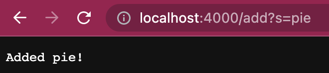

## Lab Report 3
______
# Part 1

<br>*Simple Search Engine* Lab 2

```
# code block
import java.io.IOException;
import java.net.URI;
import java.util.ArrayList;
class Handler implements URLHandler{

    ArrayList<String> str = new ArrayList<String>();

    public String handleRequest(URI url) {
        if(url.getPath().equals("/")){
            return String.format("Search Something");
        }else if(url.getPath().equals("/search")) {
            String[] parameters = url.getQuery().split("=");
            String temp = "";
            for(int i = 0; i < str.size(); i++){
                if(str.get(i).contains(parameters[1])){
                    temp = temp + str.get(i) + " ,";
                }
            }
            temp = temp.substring(0, temp.length()-2);
            return String.format("Searched: %s", temp);
        }else {
        System.out.println("Path: " + url.getPath());
        if (url.getPath().contains("/add")) {
            String[] parameters = url.getQuery().split("=");
            if (parameters[0].equals("s")) {
                str.add(parameters[1]);
                return String.format("Added %s!", parameters[1]);
            }
        }
        return "404 Not Found!";
        }   
    }

}

class SearchEngine {
    public static void main(String[] args) throws IOException {
        if(args.length == 0){
            System.out.println("Missing port number! Try any number between 1024 to 49151");
            return;
        }

        int port = Integer.parseInt(args[0]);

        Server.start(port, new Handler());
    }
}
```
<br>This is a simple Search Engine implemented through a local web browser that supports paths for *adding* new strings to list and *querying* the list to return certain values.

<br>
<br>

<br>
<br>
