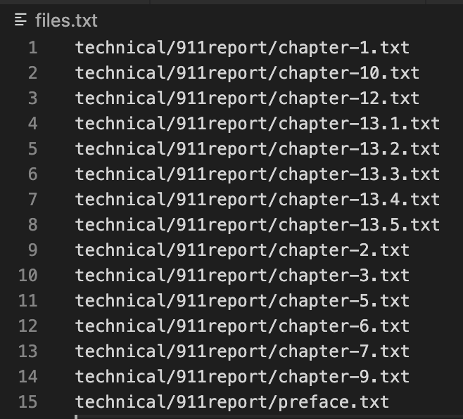
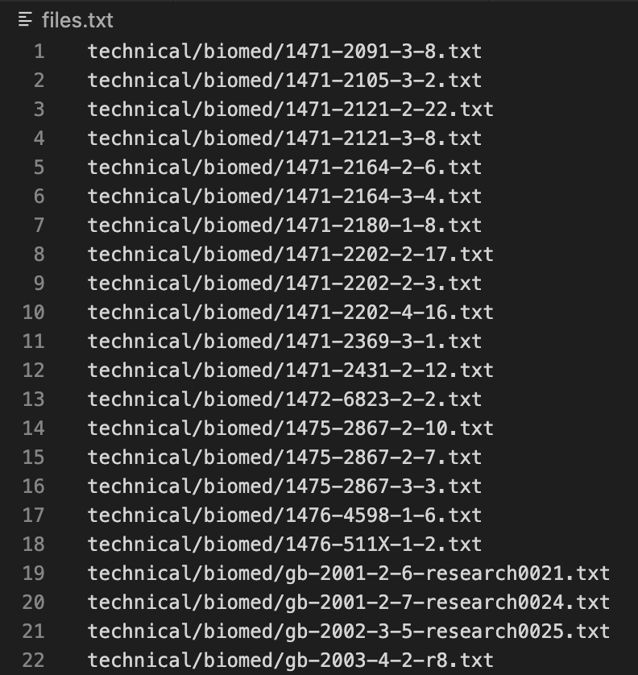
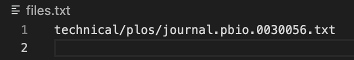
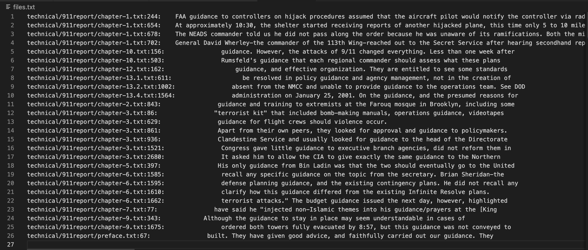
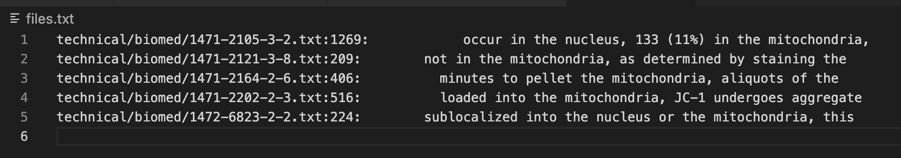
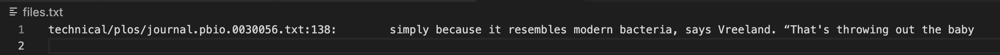
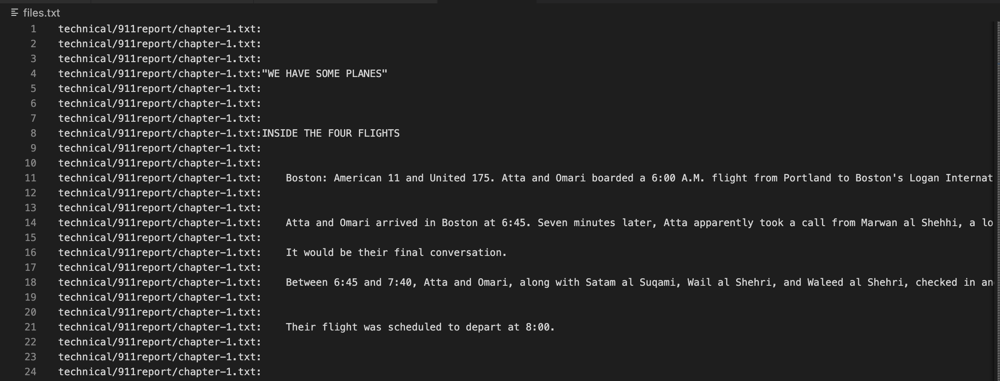
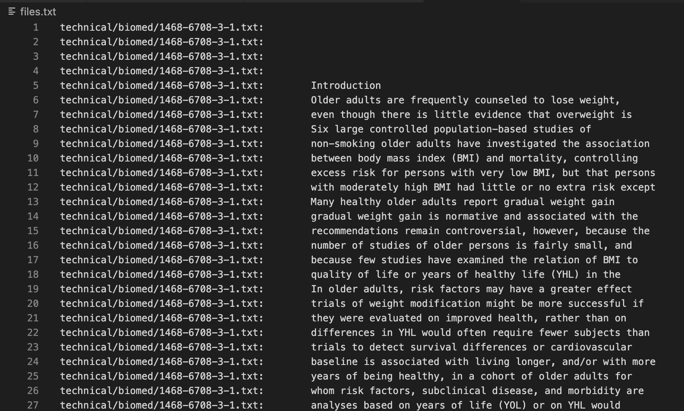
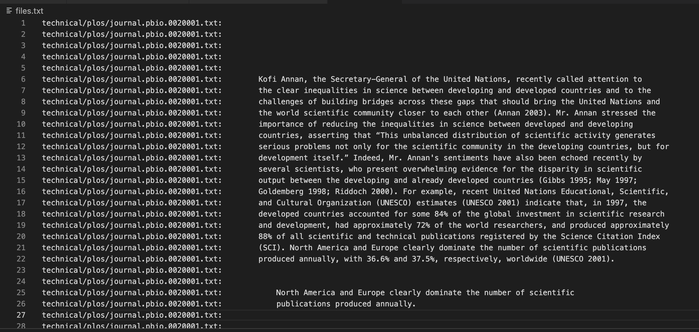

# Lab Report 3: *grep* commands

## 1. grep -l

>Example 1
```
grep -l "dance" technical/911report/* > files.txt 
```
<br>This use of grep -l looks for a key word "dance" within all the file in the directory technical/911report/ then prints out the files containing the word.
<br>

>Example 2
```
grep -l "the mitochondria" technical/biomed/* > files.txt
```
<br>This use of grep -l looks for a key phrase "the mitochondria" within all the file in the directory technical/biomed/ then prints out the files containing the phrase.
<br>

>Example 3
```
grep -l "baby" technical/plos/* > files.txt
```
<br>This use of grep -l looks for the word "baby" within all the file in the directory technical/plos/ and only printed one file because only one journal had the word "baby" in it.
<br>

<br>**USE**
<br>grep -l could be useful because it acts like a google search engine that will return all the files that contains the key word or phrase. Therefore, if you need to find a file that contains certain topic of information then you can use -l to identify the file instead of only lines that have the word. 

---
## 2. grep -n

>Example 1
```
grep -n "guidance" technical/911report/* > files.txt 
```
<br>This use of grep -n to look for lines that contains the word "guidance" within the files in technical/911report/ directory. It prints out the complete file path, the line number the word is found in, and the line of text. 
<br>

>Example 2
```
grep -n "the mitochondria," technical/biomed/* > files.txt
```
<br>This use of grep -n to look for lines that contains "the mitochondria," within the files in technical/biomed/ directory. It prints out 5 lines with the complete file path along with which line the phrase was found in. 
<br>

>Example 3
```
grep -n "baby" technical/plos/* > files.txt 
```
<br>This code also search for the key word "baby" like for -l but instead of just printing out which file it is in, it printed out the line, line number, and file name. In this case we found that only one line in the one file that conatins the word "baby" has the word "baby".
<br>

<br>**USE**
This command is useful because it can save time when you are looking through files to find specific information on where the word or phrase is. If this were to be used on a journal or article text then iy can be used to find lines for future citation, or else, it can be applied to easily find out where a certain line of code you remember write is. 

---
## 3. grep -v

>Example 1
```
grep -v "the " technical/911report/* > files.txt
```
<br>This line of code using grep -v returned all the lines within the files in the technical/911report/ directory that didn't include "the ".
<br>

>Example 2
```
grep -v "\." technical/biomed/* > files.txt  
```
<br>This use of -v returned the files and line without a period from the technical/biomed/ directory. 
<br>

>Example 3
```
grep -v "baby" technical/plos/* > files.txt
```
<br>This code that searches throught the technical/plos/ directory returned all the files that did not contain "baby", so it returned everything in plos except one line. 
<br>

<br> **USE**
<br>The grep -v command could be use to filter out what you don't want to see within a text. Many shopping websites have options to filter out certain items and even google has an option to exlcude words by using "-" so this acts in that same way. 