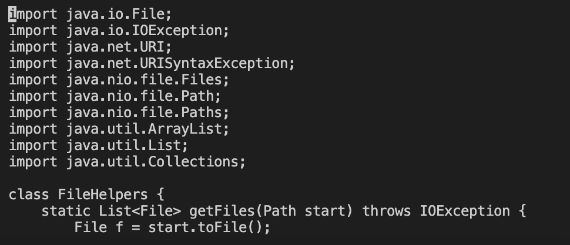
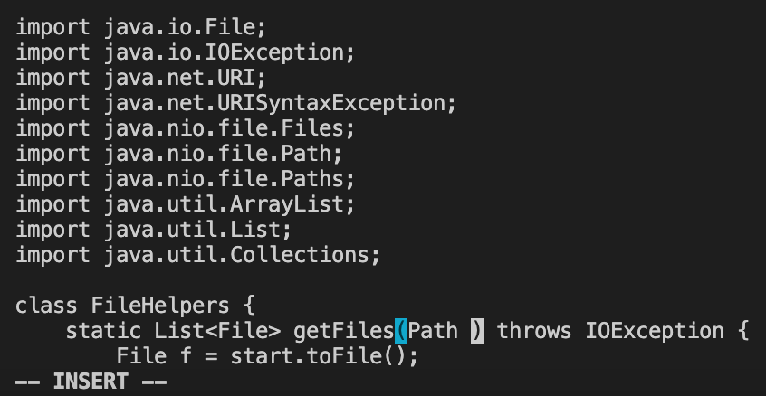

# Lab Report 4: Vim
## **Part 1**: Changing the name of the start parameter and its uses to base using vim

 **Vim Key Strokes**
 After entering vim with `vim DocSerachServer.java`
 I press the following keys `/start<enter>cgnbase<esc>n.n.<shift>;wq<enter>`
 resulting in > 24 keystrokes

 The first part after getting in vim, the cursor will highlight the very first character in the file, then you can type `/start<enter>` to find the word "start" in the file which the third image show it highlighting the first charcter of "start".
 
 
 

 After you can type `cgn` to replace the word which you then type the word you want in this case being "base" and click `<esc>` to exit the editing.
 
 

 The next step, you can press `n` to find the next instance of the word you searched for and press `.` to repeat your previous action which was deleteing and replacing "start" with "base" using `cgn`.
 
 

 Then you repeat `n.`
 

 Lastly to save and exit you use ":wq<enter>` or `<shift>;wq<enter>`.
 

## **Part 2**: Comparing Vim and Scp
 **SCP Method**
 Use pastable scp to upload file to remote server, then use bash test.sh to run test file
 Time took: 46.52 seconds
 The most difficult part of scp is the scp and ssh process which I have to type in or copy a long user name.

 **Vim Method**
 Do part 1 on remote server
 Time took: 30.41 seconds
 The most difficult part of vim is to get use to the the way vim operates and how each key works

 I think I still would prefer the general scp method because I get to see the file more clearly with its color code. It is just easier for me to read and I am too use to using the mouse to navigate through the code. However, if it is for smaller changes I think I would like vim more because of its efficiency. I can't deny how mich faster vim can be, for this comparison, I fumbled on typing while working with vim but somehow I was still 10 seconds quicker than scp. 
