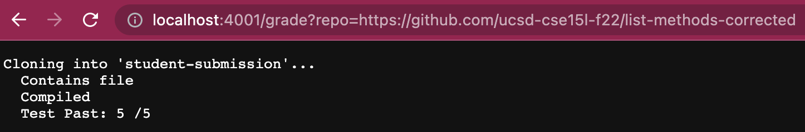
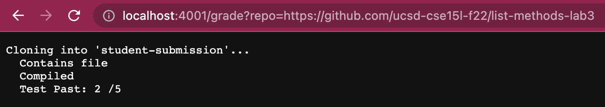
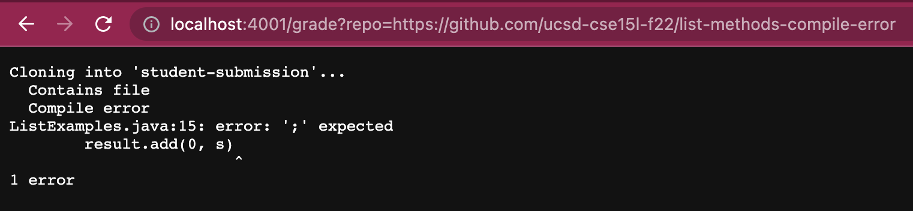
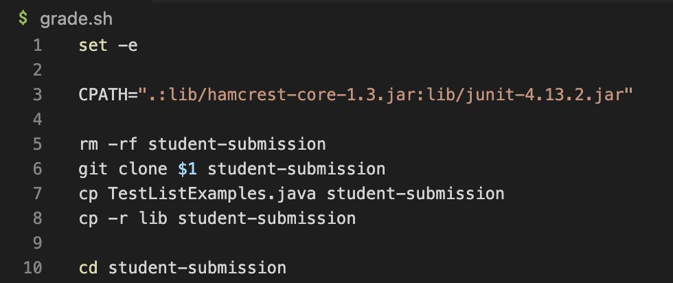
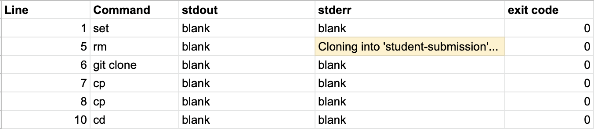
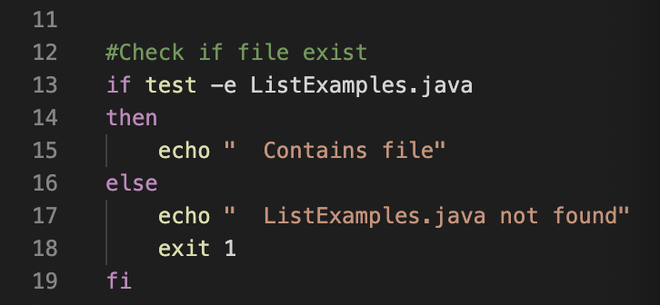
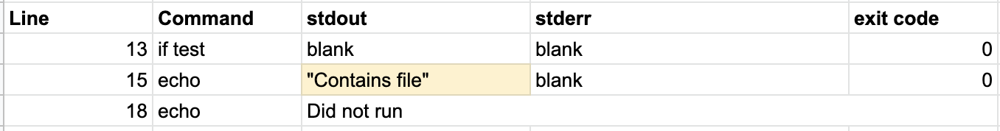
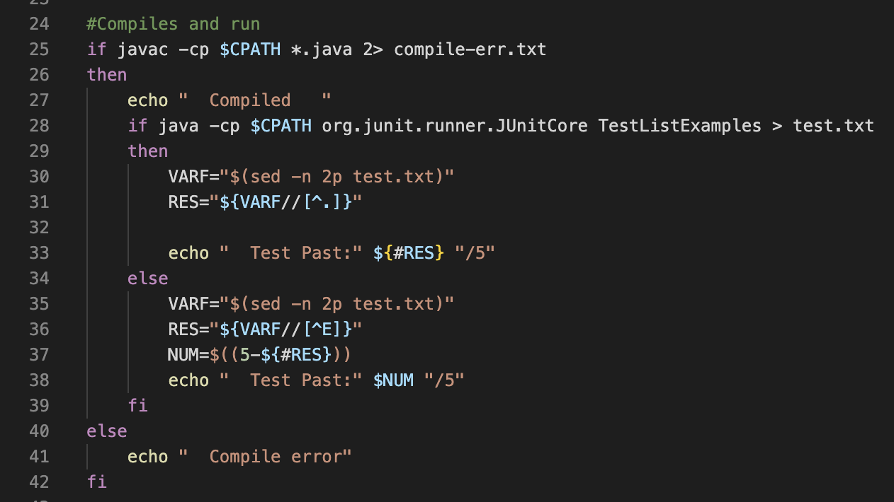
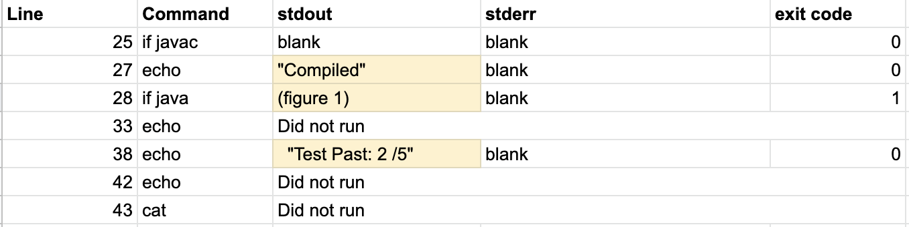
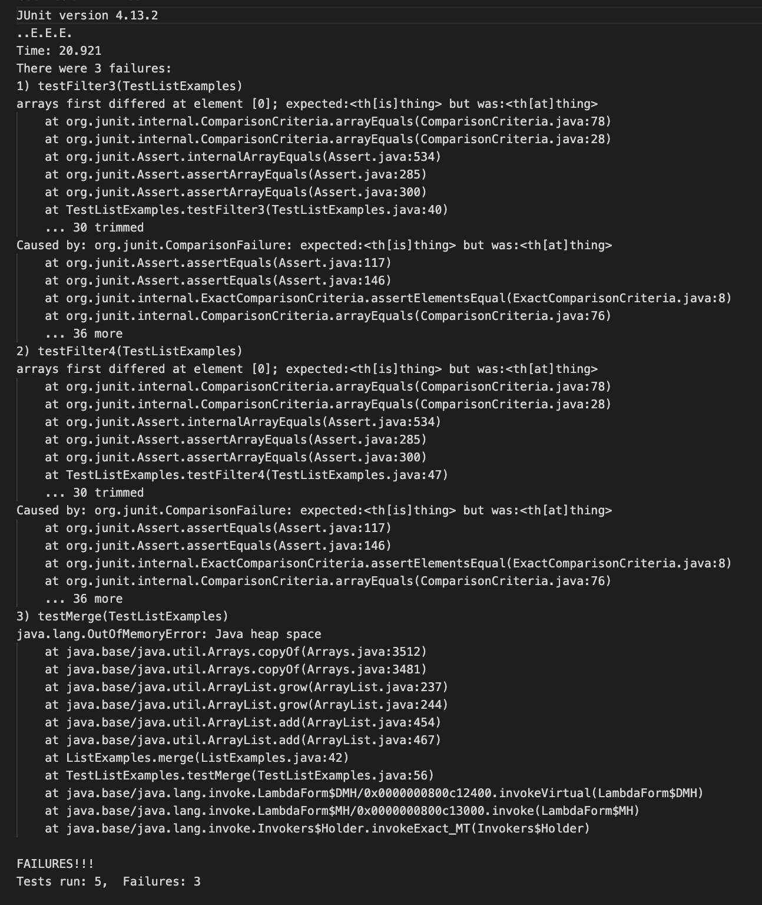

# Lab Report 5: Shell Script

<br>**grade.sh** code
```
set -e

CPATH=".:lib/hamcrest-core-1.3.jar:lib/junit-4.13.2.jar"

rm -rf student-submission
git clone $1 student-submission 
cp TestListExamples.java student-submission
cp -r lib student-submission

cd student-submission

#Check if file exist
if test -e ListExamples.java 
then 
    echo "  Contains file"
else
    echo "  ListExamples.java not found" 
    exit 1
fi


#Compiles and run
if javac -cp $CPATH *.java 
then 
    echo "  Compiled   " 
    if java -cp $CPATH org.junit.runner.JUnitCore TestListExamples > test.txt 
    then
        VARF="$(sed -n 2p test.txt)"
        RES="${VARF//[^E]}"
        NUM=$((5-${#RES}))
        echo "  Test Past:" $NUM  "/5"
    else
        VARF="$(sed -n 2p test.txt)"
        RES="${VARF//[^E]}"
        NUM=$((5-${#RES}))
        echo "  Test Past:" $NUM "/5" 
        exit 1
    fi
else
    echo "  Compile error"
    cat compile-err.txt
    exit 1
fi
```
---
## Examples

<br>[Correct Methods](https://github.com/ucsd-cse15l-f22/list-methods-corrected)- should compile successfully and receive full points.
<br>

<br>[Incorrect Methods](https://github.com/ucsd-cse15l-f22/list-methods-lab3)- should compile successfully but not receive full credit.
<br>

<br>[Compile Error](https://github.com/ucsd-cse15l-f22/list-methods-compile-error)- this program is missing a semi-colon so it will result in a compile error.
<br>

---

## Tracing- Incorrect Methods
<br>


<br>To begin, the shell script starts with `set -e` to stop execution so the program can start off in a clean state. `CPATH` is a declared variable that will be used later on in the code. `rm -rf student-submission` will forcefully remove the existing "student-submission" code so that we can grade other students code, which is why it is accompanied by `git clone $1 student-submission` which will clone a student's repository given by `$1` in the terminal. The purpose of these two line is to get rid of old code and copy in new code which the grader will then grade. Then lines 8 and 9 will copy using the `cp` command "TestListExamples.java,"(The test that will be used to grade) and the directory "lib"(Which contains junit and hamcrest) into student-submission. All these lines of code should have a *return code* of 0 because it is the set-up before grading. 

<br>
<br>


<br>The next part contains an if statement that checks whether if the file "ListExamples.java" exit in the given submission. 
Line 12 is the start of the if statement which test which will return true if the "ListExamples.java" exist in the directory using the `-e` command. In this example, its will be true so the *return code* would be 0, then it leads to the command `echo` which will print out "Contains file" with the *return code* being 0. 
If the condition were to be false, then it would echo "ListExamples.java not found" instead then end. 
Line 19 represents the end of the if statement denoted by the backwards if.

<br>
<br>


<br>The last section of this script is compiling and running.
On line 25, the variable `CPATH` is being used. This line compiles the code using javac then sends any error to "compile-err.txt". In this case for this example, the compile was successfull so the if codition results to be "true" also meaning the *return code* is 0. This will allow it to move on to the next line and `echo` "Compiled" which means the *return code* is 0.
Then within the first statement, on line 28, a next if which has the codition of running the program after it compiled with java and send its terminal statements to a file called "test.txt". In this case it also is not true which allows it to move on in the code. *Return code* is 1 therefore it skips "then" and goes to the code with "else".
On line 35, it runs the code `sed -n 2p test.txt` and sets it to the variable `VARF`. What this line does is it reads the line(2p), from the file (test.txt which contains the output of the program when ran) then sets it to the variable (VARF). Then on the next line a new variable is created called `RES` which counts the number of times "E" appears in that line which is 3 for this example. *Return code* is 0
Note: the second line of the output when using junit is how many test has ran and amount of error (E) there is.
Then on line 38, it takes the total of 5 tests for this specific "TestListExamples.java" and subtract the amount of errors and set it to a new variable NUM. *Return code* is 0
The last part of this script is it echoing "Test Past: " with the number of test it past which is 2 over 5. It also has a *return code* of 0

Lines 29-34 didn't run because there were errors in the methods, but if it did run then it would print out Test Past: 5/5" because all test would have past. 41-45 did not run because the program compiled successfully leading to the codes in "then" instead of "else". 

<br>
<br>
<br>**(Figure 1)**
<br>